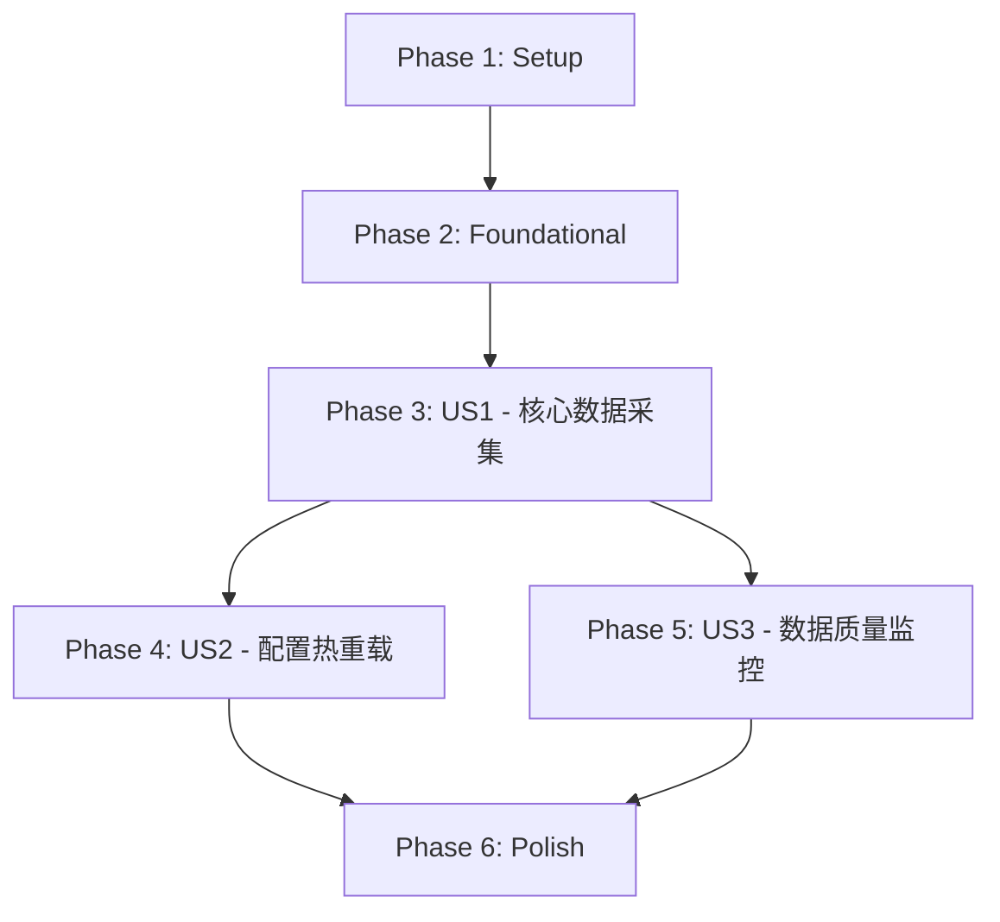

# Implementation Tasks: Data Worker容器化部署

**Feature**: 009-data-worker
**Branch**: `009-data-worker`
**Generated**: 2025-01-23
**Status**: Ready for Implementation

## Summary

本功能将GTM多进程数据采集Worker重构为容器化微服务。Data Worker作为Kafka消费者订阅控制命令，通过现有CRUD方法获取数据并批量写入ClickHouse，支持Docker Compose部署和水平扩展。

## User Stories

| Priority | Story | Independent Test | Tasks Count |
|----------|-------|-------------------|-------------|
| **P1** | 数据采集Worker容器化部署 | 启动容器验证数据采集和Redis心跳 | 15 |
| **P2** | 配置热重载 | 修改配置验证热重载生效 | 5 |
| **P3** | 数据质量监控与告警 | 模拟缺失验证告警通知 | 6 |

**Total Tasks**: 26

---

## Phase 1: Setup (项目初始化)

**目标**: 创建项目目录结构和基础配置文件

### Tasks

- [ ] T001 创建workers/data_worker模块目录结构
- [ ] T002 创建tests目录结构 (unit/integration/network)
- [ ] T003 [P] 创建Dockerfile.dataworker基于python:3.12.11-slim-bookworm
- [ ] T004 [P] 创建data_worker.yml配置文件模板
- [ ] T005 [P] 更新docker-compose.yml添加data-worker服务

---

## Phase 2: Foundational (阻塞前置任务)

**目标**: 实现所有User Story共享的基础组件

### 2.1 DTO定义

- [ ] T006 [P] 创建DataCommandDTO在src/interfaces/dtos/data_command_dto.py
- [ ] T007 [P] 创建WorkerStatus枚举在src/workers/data_worker/models.py
- [ ] T008 [P] 创建DataQualityReport模型在src/workers/data_worker/models.py

### 2.2 CLI入口

- [ ] T009 添加data-worker命令到src/client/data_worker_cli.py
- [ ] T010 [P] 更新main.py添加dataworker子命令路由

### 2.3 容器入口点

- [ ] T011 创建容器入口点src/livecore/data_worker.py

---

## Phase 3: User Story 1 - 数据采集Worker容器化部署 (P1)

**目标**: 核心数据采集功能，Worker订阅Kafka并执行数据采集

**独立测试**: 启动容器后验证数据能够从数据源获取并存储到数据库，Redis心跳正常

### 3.1 Worker核心类

- [ ] T012 [US1] 创建DataWorker主类在src/workers/data_worker/worker.py
- [ ] T013 [US1] 实现threading.Thread继承和线程生命周期管理
- [ ] T014 [US1] 实现WorkerStatus状态机 (STOPPED/STARTING/RUNNING/STOPPING/ERROR)
- [ ] T015 [US1] 实现threading.Event优雅关闭机制

### 3.2 Kafka集成

- [ ] T016 [US1] 实现GinkgoConsumer订阅ginkgo.live.control.commands
- [ ] T017 [US1] 实现Kafka消息解析和命令路由
- [ ] T018 [US1] 实现手动offset commit (成功后commit)
- [ ] T019 [US1] 配置consumer group为data_worker_group

### 3.3 控制命令处理

- [ ] T020 [US1] [P] 实现bar_snapshot命令处理
- [ ] T021 [US1] [P] 实现update_selector命令处理
- [ ] T022 [US1] [P] 实现update_data命令处理
- [ ] T023 [US1] [P] 实现heartbeat_test命令处理

### 3.4 数据采集

- [ ] T024 [US1] 集成BarCRUD获取数据 (services.data.cruds.bar())
- [ ] T025 [US1] 实现批量写入ClickHouse (add_batch, 目标1000+条/批)
- [ ] T026 [US1] 实现@retry装饰器自动重试 (最多3次)

### 3.5 Redis心跳

- [ ] T027 [US1] 实现Redis心跳上报 (heartbeat:data_worker:{node_id}, TTL=30s)
- [ ] T028 [US1] 实现心跳线程 (10秒间隔, daemon线程)

### 3.6 日志和监控

- [ ] T029 [US1] 集成GLOG记录操作和错误日志
- [ ] T030 [US1] 实现统计信息收集 (messages_processed, bars_written等)

### 3.7 容器化和测试

- [ ] T031 [US1] 实现Docker healthcheck (is_healthy方法)
- [ ] T032 [US1] [P] 编写单元测试tests/unit/workers/data_worker/test_worker.py
- [ ] T033 [US1] [P] 编写集成测试tests/integration/workers/data_worker/test_kafka_integration.py
- [ ] T034 [US1] [P] 编写容器测试验证启动和数据采集

---

## Phase 4: User Story 2 - 配置热重载 (P2)

**目标**: 支持配置热重载，无需重启容器

**独立测试**: 修改配置文件后验证Worker能够热重载配置

### Tasks

- [ ] T035 [US2] [P] 实现配置文件监听 (通过Kafka reload命令触发)
- [ ] T036 [US2] 实现GCONF配置读取和验证
- [ ] T037 [US2] 实现配置缺失时降级到默认值
- [ ] T038 [US2] 实现配置格式错误时的友好错误提示
- [ ] T039 [US2] [P] 编写配置热重载测试

---

## Phase 5: User Story 3 - 数据质量监控与告警 (P3)

**目标**: 监控数据采集质量，发送告警通知

**独立测试**: 模拟数据缺失验证告警通知发送

### 5.1 数据质量报告

- [ ] T040 [US3] [P] 实现DataQualityReport生成 (采集量、成功率、异常统计)
- [ ] T041 [US3] [P] 实现数据验证器 (检测异常数据如负价格)
- [ ] T042 [US3] 推送质量报告到Kafka ginkgo.notifications主题

### 5.2 告警机制

- [ ] T043 [US3] [P] 实现数据缺失告警 (缺失率>20% ERROR, >5% WARNING)
- [ ] T044 [US3] [P] 实现数据延迟告警 (>10分钟 ERROR, >5分钟 WARNING)
- [ ] T045 [US3] [P] 编写数据质量监控测试

---

## Phase 6: Polish & Cross-Cutting Concerns

**目标**: 代码质量、文档、部署验证

### Tasks

- [ ] T046 [P] 添加三行代码头部注释 (Upstream/Downstream/Role)
- [ ] T047 [P] 添加类型注解支持静态类型检查
- [ ] T048 [P] 使用@time_logger装饰器监控性能
- [ ] T049 [P] 更新quickstart.md添加完整使用文档
- [ ] T050 端到端容器部署测试 (4实例验证负载均衡)

---

## Dependencies

### Story Completion Order



### Critical Path

1. **Setup** → **Foundational** → **US1** → **Polish** (MVP)
2. **US2** 和 **US3** 可以在US1完成后并行开发

---

## Parallel Execution Examples

### Phase 1 (Setup) - 并行任务

```bash
# 可同时执行
T003: 创建Dockerfile.dataworker &
T004: 创建data_worker.yml &
T005: 更新docker-compose.yml &
wait
```

### Phase 2.1 (DTO定义) - 并行任务

```bash
# 可同时执行
T006: 创建DataCommandDTO &
T007: 创建WorkerStatus枚举 &
T008: 创建DataQualityReport模型 &
wait
```

### Phase 3.4 (控制命令处理) - 并行任务

```bash
# 可同时执行 (不同文件，无依赖)
T020: 实现bar_snapshot命令 &
T021: 实现update_selector命令 &
T022: 实现update_data命令 &
T023: 实现heartbeat_test命令 &
wait
```

### Phase 3.7 (测试) - 并行任务

```bash
# 可同时执行
T032: 单元测试 &
T033: 集成测试 &
T034: 容器测试 &
wait
```

---

## Implementation Strategy

### MVP Scope (First Iteration)

**目标**: 验证核心架构和技术选型

**包含**:
- Phase 1: Setup (全部)
- Phase 2: Foundational (DTO定义、CLI入口)
- Phase 3: US1核心功能 (Worker类、Kafka集成、bar_snapshot命令、Redis心跳、基础日志)

**不包含**:
- US2: 配置热重载
- US3: 数据质量监控
- 完整测试覆盖 (仅基础验证)

**成功标准**:
- 容器成功启动
- 接收Kafka消息执行数据采集
- Redis心跳正常上报
- 数据成功写入ClickHouse

### Incremental Delivery

| 迭代 | 新增功能 | 交付时间 |
|------|---------|---------|
| MVP | 核心数据采集 | 第1周 |
| +US2 | 配置热重载 | 第2周 |
| +US3 | 数据质量监控 | 第3周 |
| Polish | 完整测试和文档 | 第4周 |

---

## File Manifest

### 新建文件

```
src/ginkgo/workers/data_worker/
├── __init__.py
├── worker.py              # DataWorker主类
├── models.py               # WorkerStatus, DataQualityReport
└── config.py               # 配置加载 (如需要)

src/ginkgo/interfaces/dtos/
└── data_command_dto.py     # Kafka控制命令DTO

src/ginkgo/client/
└── data_worker_cli.py      # CLI命令

src/ginkgo/livecore/
└── data_worker.py          # 容器入口点

.conf/
├── Dockerfile.dataworker
└── data_worker.yml

tests/
├── unit/workers/data_worker/
│   └── test_worker.py
├── integration/workers/data_worker/
│   └── test_kafka_integration.py
└── network/workers/data_worker/
    └── test_data_source.py (如需要)
```

### 修改文件

```
.conf/docker-compose.yml       # 添加data-worker服务
src/main.py                     # 添加dataworker子命令路由
```

---

## Notes

1. **数据源集成**: 使用现有`BarCRUD.get_bars()`方法，数据源配置已集成在内部
2. **Kafka topic**: 订阅`ginkgo.live.control.commands`（与TaskTimer发送的主题一致）
3. **Consumer group**: `data_worker_group`用于多实例负载均衡
4. **Redis心跳**: `heartbeat:data_worker:{node_id}`与TaskTimer模式一致
5. **测试优先级**: 遵循TDD原则，先写测试再实现功能（FR-010）
6. **代码注释**: 所有新文件必须包含三行头部注释（FR-039）
7. **容器镜像**: 基于python:3.12.11-slim-bookworm，使用uv加速依赖安装
