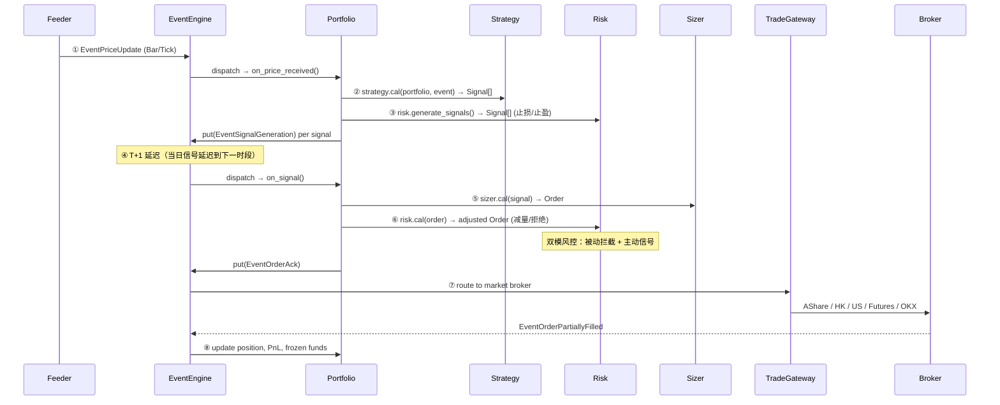
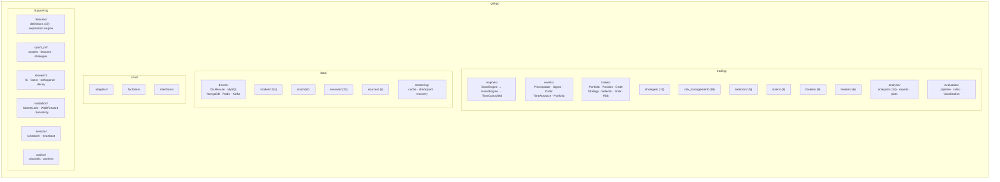

# Ginkgo

Modern Python Quantitative Trading Library

Ginkgo is a quantitative trading framework featuring event-driven backtesting, multi-database support, complete risk management, and a Web UI for strategy management.

## Features

- **Event-Driven Backtesting**: `PriceUpdate -> Strategy -> Signal -> Portfolio -> Order -> Fill`
- **Multi-Database Support**: ClickHouse (time-series), MySQL (relational), MongoDB (documents), Redis (cache)
- **Multiple Data Sources**: Tushare, Yahoo Finance, AKShare, BaoStock, TDX
- **Complete Risk Control**: Position management, stop-loss/profit, real-time monitoring
- **Web UI**: Vue 3 + shadcn-vue + Tailwind CSS dashboard for backtest/portfolio/component management
- **Live Trading**: OKX broker integration with heartbeat monitoring and crash recovery
- **CLI Interface**: Typer-based CLI with Rich formatting

## Architecture

### System Overview

```mermaid
graph TB
    subgraph "🖥️ Application Layer"
        CLI["<b>CLI</b><br/>Typer + Rich<br/><i>40 commands</i>"]
        API["<b>REST API</b><br/>FastAPI<br/><i>15 routers</i>"]
        WEB["<b>Web UI</b><br/>Vue 3 + shadcn-vue<br/><i>19 views</i>"]
    end

    subgraph "⚙️ Worker Layer"
        BW["<b>Backtest Worker</b><br/>Kafka consumer"]
        EN["<b>Execution Node</b><br/>Live order routing"]
    end

    subgraph "🧠 Service Hub (Dependency Injection)"
        SH["ServiceHub<br/><i>11 module containers</i>"]
        SH --- M1["data"] & M2["trading"] & M3["core"]
        SH --- M4["features"] & M5["quant_ml"] & M6["research"]
        SH --- M7["validation"] & M8["notifier"] & M9["optimization"]
        SH --- M10["comparison"] & M11["logging"]
    end

    subgraph "📊 Trading Engine"
        EE["EventEngine<br/><i>事件队列 + 线程分发</i>"] --> TCE["TimeControlledEngine<br/><i>回测/实盘统一</i>"]
        EE --> FDR["Data Feeders (6)"]
        EE --> PTF["Portfolio<br/><i>中央编排器</i>"]
        PTF --> STR["Strategy (15)"]
        PTF --> RSK["Risk (18)"]
        PTF --> SIZ["Sizer (3)"]
        PTF --> SEL2["Selector (5)"]
    end

    subgraph "🔀 Gateway & Brokers"
        GW["TradeGateway<br/><i>多市场路由</i>"]
        GW --- B1["AShare (T+1)"] & B2["HK Stock"]
        GW --- B3["US Stock"] & B4["Futures"]
        GW --- B5["OKX Crypto"] & B6["Sim"]
    end

    subgraph "🗄️ Data Layer"
        DRV["Drivers"]
        DRV --- CH["ClickHouse<br/><i>时序数据</i>"]
        DRV --- MY["MySQL<br/><i>关系数据</i>"]
        DRV --- MO["MongoDB<br/><i>文档数据</i>"]
        DRV --- RD["Redis<br/><i>缓存</i>"]
        DRV --- KF["Kafka<br/><i>消息队列</i>"]
        SRC["Data Sources"]
        SRC --- S1["Tushare"] & S2["AKShare"]
        SRC --- S3["Yahoo"] & S4["BaoStock"] & S5["TDX"]
    end

    CLI & API & WEB --> SH
    BW & EN --> SH
    SH --> EE & DRV & SRC
    EE --> PTF
    PTF --> GW

    style SH fill:#4A90D9,color:#fff
    style EE fill:#E8A838,color:#fff
    style PTF fill:#D94A7A,color:#fff
    style GW fill:#7A4AD9,color:#fff
    style DRV fill:#50B87E,color:#fff
```



### Trading Pipeline — Event Flow



### Module Map



### Key Design Rules

| Rule | Description |
|------|-------------|
| **单向数据流** | `Selector → Strategy → Sizer → Risk`，禁止反向调用 |
| **三层分离** | `API → Service → CRUD`，API 禁止直接调 CRUD |
| **事件驱动** | 引擎通过 Queue 分发事件，解耦数据与交易逻辑 |
| **容器注入** | ServiceHub 懒加载 11 个 DI 容器，按需初始化 |
| **引擎双模** | 仅分 `BACKTEST` / `LIVE`，共享 EventEngine 机制 |
| **Portfolio 编排** | Portfolio 持有全部组件（策略/风控/Sizer/分析器），是交易核心 |
| **双模风控** | 被动拦截 `cal(order)` + 主动信号 `generate_signals()` |
| **T+1 延迟** | 当日信号延迟到下一时段才执行（A 股规则） |

### Component Inventory

| Category | Count | Examples |
|----------|-------|---------|
| **Strategies** | 15 | MA Crossover, Momentum, Mean Reversion, Dual Thrust, Scalping, ML Predictor |
| **Risk Managers** | 18 | Position Ratio, Loss Limit, Profit Target, Max Drawdown, Volatility, Concentration |
| **Selectors** | 5 | Fixed, CN All, Momentum, Popularity |
| **Sizers** | 3 | Fixed, ATR, Ratio |
| **Brokers** | 8 | Sim, AShare, HK Stock, US Stock, Futures, OKX, Manual, Auto |
| **Feeders** | 6 | Backtest, Live, OKX, Alpaca, EastMoney, Fushu |
| **Analyzers** | 24 | Net Value, Max Drawdown, Sharpe, Calmar, Profit Factor, Annualized Returns |
| **Data Sources** | 5 | Tushare, AKShare, Yahoo, BaoStock, TDX |
| **DB Drivers** | 5 | ClickHouse, MySQL, MongoDB, Redis, Kafka |
| **Factors** | 158+ | Alpha158, Barra, Fama-French, WorldQuant Alpha101 |

### Service Access

```python
from ginkgo import services

bar_crud = services.data.cruds.bar()
stockinfo_service = services.data.services.stockinfo_service()
engine = services.trading.engines.historic()
```

## Quick Start

### Installation

```bash
# uv (recommended)
uv sync
```

> **Note:** You need [uv](https://docs.astral.sh/uv/) installed. If you don't have it, run `curl -LsSf https://astral.sh/uv/install.sh | sh`.

Docker containers (Kafka, Redis, MySQL, ClickHouse, MongoDB) start automatically.

### Global CLI

After installation, `ginkgo` is globally available:

```bash
ginkgo version
ginkgo status
ginkgo debug on          # Required for database operations
```

### Configuration

```bash
vi ~/.ginkgo/config.yaml   # Main config
vi ~/.ginkgo/secure.yml    # Credentials (base64 encoded)
```

## CLI Reference

### Data Management

```bash
ginkgo data init                           # Initialize database tables
ginkgo data update --stockinfo             # Update stock information
ginkgo data update day --code 000001.SZ    # Update daily bar data
ginkgo data list stockinfo --page 50       # List stock info
```

### Portfolio & Components

```bash
ginkgo portfolio create --name "my_portfolio" --capital 1000000
ginkgo portfolio list
ginkgo portfolio get <uuid> --details

ginkgo component list
ginkgo component create --type strategy --name "my_strategy"
ginkgo component show <uuid>

# Bind component with parameters
ginkgo portfolio bind-component <portfolio_id> <file_id> --type strategy \
  --param '0:"MyStrategy"' --param '1:0.3'
```

### Backtesting

```bash
ginkgo backtest create --portfolio <id> --start 2025-01-01 --end 2026-01-01 --name "test"
ginkgo backtest run <backtest_id>
ginkgo backtest cat <backtest_id>
ginkgo backtest list
```

### Worker Management

```bash
ginkgo worker status
ginkgo worker start --count 4
ginkgo worker run --debug
```

### Development Servers

```bash
ginkgo serve api      # FastAPI server on :8000
ginkgo serve webui    # Vue dev server on :5173
```

## Strategy Development

```python
from ginkgo.trading.strategies.strategy_base import BaseStrategy
from ginkgo.entities import Signal
from ginkgo.enums import DIRECTION_TYPES

class MyStrategy(BaseStrategy):
    def cal(self, portfolio_info, event):
        bars = self.data_feeder.get_bars(code, start, end)
        if self.should_buy(bars):
            return [Signal(code=code, direction=DIRECTION_TYPES.LONG)]
        return []
```

### Risk Management

```python
from ginkgo.trading.risk_management.position_ratio_risk import PositionRatioRisk
from ginkgo.trading.risk_management.loss_limit_risk import LossLimitRisk
from ginkgo.trading.risk_management.profit_target_risk import ProfitTargetRisk

portfolio.add_risk_manager(PositionRatioRisk(max_position_ratio=0.2))
portfolio.add_risk_manager(LossLimitRisk(loss_limit=10.0))
portfolio.add_risk_manager(ProfitTargetRisk(profit_limit=20.0))
```

## Web UI

Vue 3 + shadcn-vue + Tailwind CSS + ECharts + Lightweight Charts dashboard:

```bash
ginkgo serve webui    # http://localhost:5173
```

Features: portfolio management, backtest creation/monitoring, component editor (Monaco), factor research, real-time charts.

## Live Trading

OKX exchange integration with:

- **LiveEngine**: Unified lifecycle management
- **OKXBroker**: Exchange adapter implementing IBroker interface
- **BrokerManager**: Instance lifecycle (start/pause/resume/stop)
- **HeartbeatMonitor**: Timeout detection and recovery

```bash
python -m ginkgo.livecore.main live-start   # Start live engine
python -m ginkgo.livecore.main live-status  # Check status
```

## System Requirements

- **Python**: 3.12.8+
- **Databases**: ClickHouse, MySQL, MongoDB, Redis
- **OS**: Linux, macOS, Windows
- **Memory**: 4GB+ recommended for backtesting

## Contributing

1. Fork the repository
2. Create feature branch: `git checkout -b {seq}-{type}/{description}`
   - Branch format: `{incrementing-number}-{type}/{description}`
   - Types: `feat`, `fix`, `refactor`, `test`, `docs`, `chore`
   - Example: `4128-feat/webui-navigation`
3. Commit and push to branch
4. Open Pull Request

## License

MIT License - see the LICENSE file for details.
