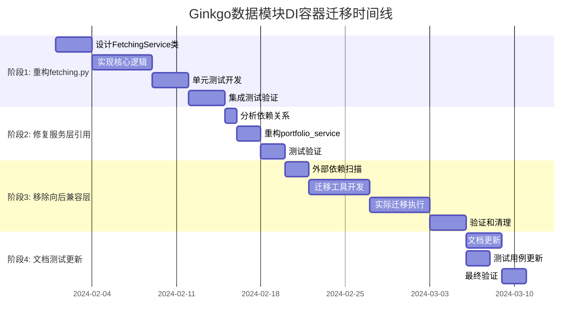

# Ginkgo数据模块向后兼容层迁移计划

## 概述

本文档详细分析了Ginkgo数据模块中尚未迁移到依赖注入(DI)容器的部分，并提供了完整的迁移计划。目标是实现100%的DI容器化，消除混合访问模式，提升架构一致性和可维护性。

---

## 1. 当前状况分析

### 1.1 混合访问模式现状

当前data模块同时存在两种访问模式：

```python
# 新模式 - DI容器访问
from ginkgo.data.containers import container
bar_service = container.bar_service()
bar_crud = container.cruds.bar()

# 旧模式 - 直接访问 (待迁移)
from ginkgo.data.utils import get_crud
bar_crud = get_crud('bar')
```

### 1.2 未迁移部分详细清单

#### :red_circle: 高优先级 - 核心业务逻辑

##### 1.2.1 fetching.py模块 - 数据获取核心逻辑

**文件位置**: `src/ginkgo/data/fetching.py`

**问题描述**: 这是data模块的核心数据获取逻辑，直接使用 `get_crud()` 和手动实例化数据源，未通过DI容器管理依赖。

**具体问题代码**:

```python
# 第26行: 直接使用get_crud获取CRUD实例
def _get_adjustfactor_fetch_range(code: str, fast_mode: bool) -> tuple:
    adjustfactor_crud = get_crud('adjustfactor')  # :x: 应使用DI容器
    # ...

# 第53行: 直接使用get_crud获取CRUD实例  
def _persist_adjustfactors(code: str, items: list, fast_mode: bool):
    adjustfactor_crud = get_crud('adjustfactor')  # :x: 应使用DI容器
    # ...

# 第70行: 直接实例化数据源
def process_adjustfactor_data(code: str, fast_mode: bool):
    raw_data = GinkgoTushare().fetch_cn_stock_adjustfactor(...)  # :x: 应使用DI容器
    # ...

# 第83行: 直接使用get_crud获取CRUD实例
def _upsert_stock_info_batch(all_stocks_df: pd.DataFrame):
    stock_info_crud = get_crud('stock_info')  # :x: 应使用DI容器
    # ...

# 第109行: 直接实例化数据源
def process_stockinfo_data():
    all_stocks = GinkgoTushare().fetch_cn_stockinfo()  # :x: 应使用DI容器
    # ...
```

**影响范围**: 
- 影响所有数据同步功能
- 影响Tushare数据源的使用
- 影响adjustfactor和stockinfo的数据处理

#### :yellow_circle: 中优先级 - 服务层局部引用

##### 1.2.2 portfolio_service.py中的局部引用

**文件位置**: `src/ginkgo/data/services/portfolio_service.py:736`

**问题描述**: 在方法内部动态导入 `get_crud`，破坏了依赖注入的一致性。

**具体问题代码**:

```python
# 第736-738行: 方法内部动态导入
try:
    from ginkgo.data.utils import get_crud  # :x: 应通过构造函数注入
    file_crud = get_crud('file')
    file_exists = file_crud.exists(filters={"uuid": file_id})
```

**影响范围**: 
- 仅影响portfolio清理功能中的文件存在性检查
- 影响范围相对较小

#### :green_circle: 低优先级 - 向后兼容接口

##### 1.2.3 __init__.py中的遗留导入

**文件位置**: `src/ginkgo/data/__init__.py:18`

**问题描述**: 主要API模块仍然导入 `get_crud` 用于"直接CRUD访问"。

**具体问题代码**:

```python
# 第18行: 保留get_crud导入
from .utils import get_crud # get_crud is still needed for direct CRUD access in getters
```

**影响范围**:
- 维护了向后兼容接口
- 可能被外部模块使用

##### 1.2.4 utils.py完整保留

**文件位置**: `src/ginkgo/data/utils.py`

**问题描述**: 整个向后兼容层模块完整保留，包含全局CRUD实例缓存。

**核心问题**:

```python
# 第33行: 全局CRUD实例缓存
_crud_instances = {}

# 第35-83行: get_crud工厂函数
def get_crud(model_name: str) -> BaseCRUD:
    # 全局缓存逻辑，可能与DI容器的单例管理冲突
    if model_name not in _crud_instances:
        class_name = f"{''.join([s.capitalize() for s in model_name.split('_')])}CRUD"
        crud_class = getattr(crud, class_name, None)
        if crud_class:
            _crud_instances[model_name] = crud_class()  # :x: 绕过DI容器管理
```

**影响范围**:
- 可能被外部系统或测试用例依赖
- 与DI容器的单例管理存在潜在冲突

---

## 2. 问题分析和影响评估

### 2.1 架构问题

#### 双重实例管理
```python
# DI容器管理的实例
container_crud = container.cruds.bar()

# utils.py缓存的实例  
utils_crud = get_crud('bar')

# 两个实例可能不同步，造成状态不一致
assert container_crud is not utils_crud  # True - 这是问题!
```

#### 依赖关系不透明
```python
# 当前fetching.py - 隐式依赖
def process_adjustfactor_data(code: str, fast_mode: bool):
    # 无法从函数签名看出依赖关系
    adjustfactor_crud = get_crud('adjustfactor')  # 隐式依赖
    tushare_source = GinkgoTushare()               # 隐式依赖
```

#### 测试困难
```python
# 难以进行单元测试
def test_process_adjustfactor_data():
    # 无法mock get_crud()和GinkgoTushare()的返回值
    # 测试必须依赖真实的数据库和网络连接
```

### 2.2 风险评估

| 风险类别 | 风险等级 | 描述 | 缓解措施 |
|---------|---------|------|----------|
| 功能回归 | 中 | 迁移过程中可能破坏现有功能 | 完善的测试覆盖和分阶段迁移 |
| 性能影响 | 低 | DI容器可能引入轻微性能开销 | 基准测试验证 |
| 外部依赖 | 中 | 外部系统可能依赖旧接口 | 渐进式废弃和文档更新 |
| 开发成本 | 中 | 需要重构大量代码 | 合理的时间规划和资源分配 |

---

## 3. 详细迁移计划

### 3.1 总体策略

采用**渐进式迁移**策略，确保系统稳定性：

1. **向前兼容**: 新代码全部使用DI容器
2. **渐进替换**: 逐步替换旧代码
3. **并行运行**: 迁移期间新旧系统并存
4. **最终清理**: 确认无依赖后移除旧代码

### 3.2 阶段性迁移计划

#### :rocket: 阶段1: 重构fetching.py为FetchingService (2-3周)

##### 目标
将 `fetching.py` 中的函数重构为基于DI容器的 `FetchingService`。

##### 具体步骤

**步骤1.1: 创建FetchingService类**

```python
# 新文件: src/ginkgo/data/services/fetching_service.py
from .base_service import DataService

class FetchingService(DataService):
    def __init__(self, 
                 adjustfactor_crud, 
                 stockinfo_crud,
                 tushare_source,
                 stockinfo_service):
        """通过DI容器注入所有依赖"""
        super().__init__()
        self.adjustfactor_crud = adjustfactor_crud
        self.stockinfo_crud = stockinfo_crud  
        self.tushare_source = tushare_source
        self.stockinfo_service = stockinfo_service
    
    @retry(max_try=3)
    def process_adjustfactor_data(self, code: str, fast_mode: bool) -> Dict[str, Any]:
        """重构后的adjustfactor数据处理"""
        if not self.stockinfo_service.is_code_in_stocklist(code):
            return {"success": False, "error": "Code not in stock list"}
        
        start_date, end_date = self._get_adjustfactor_fetch_range(code, fast_mode)
        
        try:
            raw_data = self.tushare_source.fetch_cn_stock_adjustfactor(
                code=code, start_date=start_date, end_date=end_date
            )
            # ... 处理逻辑
        except Exception as e:
            return {"success": False, "error": str(e)}
    
    def _get_adjustfactor_fetch_range(self, code: str, fast_mode: bool) -> tuple:
        """使用注入的CRUD而非get_crud()"""
        start_date = datetime_normalize(GCONF.DEFAULTSTART)
        if fast_mode:
            latest = self.adjustfactor_crud.find(
                filters={"code": code}, page_size=1, desc_order=True
            )
            if latest:
                start_date = latest[0].timestamp + timedelta(days=1)
        return start_date, datetime.now()
```

**步骤1.2: 更新容器配置**

```python
# 更新 src/ginkgo/data/containers.py
class Container(containers.DeclarativeContainer):
    # ... 现有配置 ...
    
    # 新增FetchingService
    fetching_service = providers.Singleton(
        FetchingService,
        adjustfactor_crud=adjustfactor_crud,
        stockinfo_crud=stockinfo_crud,
        tushare_source=ginkgo_tushare_source,
        stockinfo_service=stockinfo_service
    )
```

**步骤1.3: 更新公共API**

```python
# 更新 src/ginkgo/data/__init__.py
@retry
@time_logger  
def fetch_and_update_adjustfactor(code: str, fast_mode: bool = True, *args, **kwargs):
    """使用新的FetchingService"""
    return container.fetching_service().process_adjustfactor_data(code, fast_mode)

@retry
@skip_if_ran
@time_logger
def fetch_and_update_stockinfo(*args, **kwargs):
    """使用新的FetchingService"""
    return container.fetching_service().process_stockinfo_data()
```

**步骤1.4: 逐步废弃原有函数**

```python
# 在原有fetching.py中添加废弃警告
import warnings

def process_adjustfactor_data(code: str, fast_mode: bool):
    warnings.warn(
        "process_adjustfactor_data is deprecated. Use FetchingService instead.",
        DeprecationWarning,
        stacklevel=2
    )
    # 保留原有实现作为临时兼容
```

##### 验收标准
- [ ] 所有现有API功能保持不变
- [ ] 新的FetchingService通过所有单元测试
- [ ] 性能无显著回退
- [ ] 可以成功mock所有依赖进行测试

##### 时间估算
- 设计和编码: 1.5周
- 测试和调试: 0.5周
- 总计: 2周

#### :wrench: 阶段2: 修复服务层引用 (1周)

##### 目标
修复 `portfolio_service.py` 中的直接 `get_crud` 引用。

##### 具体步骤

**步骤2.1: 依赖注入重构**

```python
# 修改 src/ginkgo/data/services/portfolio_service.py
class PortfolioService(ManagementService):
    def __init__(self, crud_repo, portfolio_file_mapping_crud, param_crud, file_crud):
        """添加file_crud依赖注入"""
        super().__init__(
            crud_repo=crud_repo, 
            portfolio_file_mapping_crud=portfolio_file_mapping_crud, 
            param_crud=param_crud
        )
        self.file_crud = file_crud  # 新增注入的依赖
    
    def cleanup_orphaned_mappings(self, ...):
        # 替换动态导入
        # file_crud = get_crud('file')  # :x: 旧代码
        file_exists = self.file_crud.exists(filters={"uuid": file_id})  # :white_check_mark: 新代码
```

**步骤2.2: 更新容器配置**

```python
# 更新 src/ginkgo/data/containers.py
portfolio_service = providers.Singleton(
    PortfolioService,
    crud_repo=portfolio_crud,
    portfolio_file_mapping_crud=portfolio_file_mapping_crud,
    param_crud=param_crud,
    file_crud=file_crud  # 新增依赖注入
)
```

##### 验收标准
- [ ] portfolio服务所有功能正常
- [ ] 不再有动态导入get_crud的代码
- [ ] 依赖关系明确且可测试

##### 时间估算
- 0.5周编码 + 0.5周测试 = 1周

#### :broom: 阶段3: 移除向后兼容层 (2-3周)

##### 目标
完全移除 `utils.py` 向后兼容层和相关引用。

##### 具体步骤

**步骤3.1: 外部依赖扫描**

```bash
# 扫描整个项目中get_crud的使用
find . -name "*.py" -exec grep -l "get_crud" {} \;

# 扫描外部项目(如果有)
grep -r "from ginkgo.data.utils import get_crud" /path/to/external/projects/
```

**步骤3.2: 提供迁移工具**

```python
# 新文件: tools/migrate_to_di_container.py
"""
自动化迁移工具，将get_crud调用转换为DI容器调用
"""

def migrate_get_crud_calls(file_path: str):
    """将文件中的get_crud调用转换为容器调用"""
    # 实现自动化代码转换逻辑
    pass
```

**步骤3.3: 渐进式移除**

```python
# 步骤3.3.1: 添加废弃警告
def get_crud(model_name: str) -> BaseCRUD:
    warnings.warn(
        f"get_crud('{model_name}') is deprecated. "
        f"Use 'from ginkgo.data.containers import container; "
        f"container.cruds.{model_name}()' instead.",
        DeprecationWarning,
        stacklevel=2
    )
    # 原有实现...

# 步骤3.3.2: 移除__init__.py中的导入
# from .utils import get_crud  # :x: 移除这行

# 步骤3.3.3: 最终删除utils.py文件
# rm src/ginkgo/data/utils.py
```

##### 验收标准
- [ ] 项目中无任何get_crud的直接调用
- [ ] 所有测试通过
- [ ] 外部依赖已更新或提供了迁移指南
- [ ] 文档已更新

##### 时间估算
- 扫描和评估: 0.5周
- 迁移工具开发: 1周  
- 实际迁移和测试: 1周
- 文档更新: 0.5周
- 总计: 3周

#### 📚 阶段4: 文档和测试更新 (1周)

##### 目标
更新所有相关文档和测试用例。

##### 具体步骤

**步骤4.1: 更新架构文档**
- 更新架构分析报告
- 移除向后兼容层的描述
- 添加DI容器最佳实践

**步骤4.2: 更新开发指南**
```markdown
# 新的开发指南示例

## 如何添加新的CRUD类

1. 创建CRUD类:
```python
class NewCRUD(BaseCRUD[MNewModel]):
    def _get_field_config(self) -> dict:
        return {"field": {"type": "string"}}
```

2. 无需手动注册 - 自动发现机制会处理

3. 通过容器访问:
```python
from ginkgo.data.containers import container
new_crud = container.cruds.new()  # 自动可用
```
```

**步骤4.3: 更新测试用例**
```python
# 测试用例更新示例
class TestFetchingService:
    @pytest.fixture
    def fetching_service(self):
        # 使用DI容器进行测试
        return container.fetching_service()
    
    def test_process_adjustfactor_data(self, fetching_service, mock_tushare):
        # 可以轻松mock所有依赖
        result = fetching_service.process_adjustfactor_data("000001.SZ", True)
        assert result["success"] is True
```

##### 验收标准
- [ ] 所有文档反映新的架构
- [ ] 提供完整的迁移指南
- [ ] 测试覆盖率不低于95%
- [ ] 开发指南包含最佳实践

##### 时间估算
- 1周

### 3.3 总体时间估算

| 阶段 | 预估时间 | 关键里程碑 |
|------|----------|-----------|
| 阶段1: 重构fetching.py | 2周 | FetchingService上线 |
| 阶段2: 修复服务层引用 | 1周 | 消除动态导入 |
| 阶段3: 移除向后兼容层 | 3周 | utils.py完全移除 |
| 阶段4: 文档和测试更新 | 1周 | 文档完整更新 |
| **总计** | **7周** | **完全DI容器化** |

---

## 4. 代码重构示例

### 4.1 Before & After 对比

#### 重构前 - fetching.py
```python
# :x: 问题代码 - 直接依赖和全局状态
def process_adjustfactor_data(code: str, fast_mode: bool):
    # 隐式依赖，难以测试
    if not is_code_in_stocklist(code):
        return
    
    # 直接实例化，无法控制
    adjustfactor_crud = get_crud('adjustfactor')
    
    # 硬编码数据源，难以替换
    raw_data = GinkgoTushare().fetch_cn_stock_adjustfactor(
        code=code, start_date=start_date, end_date=end_date
    )
    
    # 错误处理不完整
    model_items = _prepare_adjustfactor_models(raw_data, code)
    _persist_adjustfactors(code, model_items, fast_mode)
```

#### 重构后 - FetchingService
```python
# :white_check_mark: 优化代码 - DI容器和结构化返回
class FetchingService(DataService):
    def __init__(self, adjustfactor_crud, tushare_source, stockinfo_service):
        # 依赖注入，明确声明所有依赖
        self.adjustfactor_crud = adjustfactor_crud
        self.tushare_source = tushare_source
        self.stockinfo_service = stockinfo_service
    
    @retry(max_try=3)
    def process_adjustfactor_data(self, code: str, fast_mode: bool) -> Dict[str, Any]:
        # 结构化返回，完整的错误处理
        result = {
            "success": False,
            "code": code,
            "records_processed": 0,
            "error": None
        }
        
        # 依赖注入的服务调用
        if not self.stockinfo_service.is_code_in_stocklist(code):
            result["error"] = "Code not in stock list"
            return result
        
        try:
            # 依赖注入的数据源调用
            raw_data = self.tushare_source.fetch_cn_stock_adjustfactor(
                code=code, start_date=start_date, end_date=end_date
            )
            
            if raw_data is None or raw_data.empty:
                result["success"] = True  # 无数据也是成功
                return result
                
            model_items = self._prepare_adjustfactor_models(raw_data, code)
            self._persist_adjustfactors(code, model_items, fast_mode)
            
            result["success"] = True
            result["records_processed"] = len(model_items)
            
        except Exception as e:
            result["error"] = str(e)
            self._logger.ERROR(f"Failed to process adjustfactor for {code}: {e}")
        
        return result
```

### 4.2 测试能力对比

#### 重构前 - 难以测试
```python
# :x: 无法进行单元测试
def test_process_adjustfactor_data():
    # 无法mock get_crud()的返回值
    # 无法mock GinkgoTushare()的网络请求
    # 必须依赖真实数据库连接
    
    # 只能做集成测试
    process_adjustfactor_data("000001.SZ", True)
    # 无法验证具体行为，只能检查副作用
```

#### 重构后 - 完全可测试
```python
# :white_check_mark: 完整的单元测试能力
@pytest.fixture
def mock_dependencies():
    adjustfactor_crud = Mock()
    tushare_source = Mock()
    stockinfo_service = Mock()
    return adjustfactor_crud, tushare_source, stockinfo_service

def test_process_adjustfactor_data_success(mock_dependencies):
    adjustfactor_crud, tushare_source, stockinfo_service = mock_dependencies
    
    # 精确控制所有依赖的行为
    stockinfo_service.is_code_in_stocklist.return_value = True
    tushare_source.fetch_cn_stock_adjustfactor.return_value = pd.DataFrame({
        'adj_factor': [1.0, 1.1], 'trade_date': ['20230101', '20230102']
    })
    
    service = FetchingService(adjustfactor_crud, tushare_source, stockinfo_service)
    result = service.process_adjustfactor_data("000001.SZ", True)
    
    # 验证具体行为和返回值
    assert result["success"] is True
    assert result["records_processed"] == 2
    adjustfactor_crud.add_batch.assert_called_once()
```

---

## 5. 风险管理和回退策略

### 5.1 技术风险管理

#### 并行运行策略
```python
# 迁移期间的双重实现
class FetchingService(DataService):
    def process_adjustfactor_data(self, code: str, fast_mode: bool) -> Dict[str, Any]:
        try:
            # 新实现
            return self._new_implementation(code, fast_mode)
        except Exception as e:
            self._logger.WARNING(f"New implementation failed, falling back: {e}")
            # 回退到旧实现
            return self._legacy_implementation(code, fast_mode)
```

#### 功能验证机制
```python
# 添加验证机制确保新旧实现结果一致
def _validate_consistency(self, new_result, legacy_result):
    """验证新旧实现的结果一致性"""
    if new_result != legacy_result:
        self._logger.ERROR(f"Implementation mismatch: new={new_result}, legacy={legacy_result}")
        # 发送告警或记录问题
```

### 5.2 回退计划

#### 快速回退机制
```python
# 通过配置开关控制使用哪种实现
ENABLE_NEW_FETCHING_SERVICE = GCONF.get('enable_new_fetching_service', False)

def fetch_and_update_adjustfactor(code: str, fast_mode: bool = True):
    if ENABLE_NEW_FETCHING_SERVICE:
        return container.fetching_service().process_adjustfactor_data(code, fast_mode)
    else:
        # 回退到旧实现
        return legacy_process_adjustfactor_data(code, fast_mode)
```

#### 数据一致性保证
- 迁移过程中保持数据格式完全兼容
- 使用相同的数据库schema
- 确保事务边界一致

### 5.3 监控和告警

#### 性能监控
```python
# 添加性能对比监控
@time_logger
def process_adjustfactor_data(self, code: str, fast_mode: bool):
    start_time = time.time()
    result = self._process_logic(code, fast_mode)
    duration = time.time() - start_time
    
    # 记录性能指标
    self._logger.INFO(f"Process duration: {duration:.3f}s for {code}")
    
    return result
```

#### 错误率监控
```python
# 监控新实现的错误率
class FetchingService(DataService):
    def __init__(self, ...):
        super().__init__(...)
        self._error_count = 0
        self._total_count = 0
    
    def process_adjustfactor_data(self, code: str, fast_mode: bool) -> Dict[str, Any]:
        self._total_count += 1
        try:
            result = self._process_logic(code, fast_mode)
            if not result["success"]:
                self._error_count += 1
            return result
        except Exception as e:
            self._error_count += 1
            raise
    
    @property
    def error_rate(self) -> float:
        if self._total_count == 0:
            return 0.0
        return self._error_count / self._total_count
```

---

## 6. 最佳实践和编码规范

### 6.1 DI容器使用规范

#### 服务定义规范
```python
# :white_check_mark: 正确的服务定义
class MyService(DataService):
    def __init__(self, crud_repo, data_source, other_service):
        """
        明确声明所有依赖，便于理解和测试
        """
        super().__init__()
        self.crud_repo = crud_repo
        self.data_source = data_source  
        self.other_service = other_service
    
    @retry(max_try=3)
    def business_method(self, param: str) -> Dict[str, Any]:
        """
        返回结构化结果，包含成功状态和错误信息
        """
        result = {"success": False, "param": param, "error": None}
        try:
            # 业务逻辑
            result["success"] = True
        except Exception as e:
            result["error"] = str(e)
        return result
```

#### 容器配置规范
```python
# :white_check_mark: 正确的容器配置
class Container(containers.DeclarativeContainer):
    # 按依赖顺序配置，被依赖的服务在前
    base_service = providers.Singleton(BaseService)
    
    dependent_service = providers.Singleton(
        DependentService,
        base_service=base_service  # 清晰的依赖关系
    )
```

### 6.2 测试最佳实践

#### 单元测试模板
```python
# :white_check_mark: 标准的单元测试模板
class TestMyService:
    @pytest.fixture
    def mock_dependencies(self):
        """提供模拟的依赖对象"""
        return {
            'crud_repo': Mock(),
            'data_source': Mock(),
            'other_service': Mock()
        }
    
    @pytest.fixture  
    def service(self, mock_dependencies):
        """创建待测试的服务实例"""
        return MyService(**mock_dependencies)
    
    def test_business_method_success(self, service, mock_dependencies):
        """测试成功场景"""
        # 设置mock行为
        mock_dependencies['data_source'].fetch_data.return_value = expected_data
        
        # 执行测试
        result = service.business_method("test_param")
        
        # 验证结果
        assert result["success"] is True
        assert result["param"] == "test_param"
        
        # 验证交互
        mock_dependencies['data_source'].fetch_data.assert_called_once()
```

### 6.3 错误处理规范

#### 统一错误返回格式
```python
# :white_check_mark: 标准的错误返回格式
def standard_result_format(success: bool = False, **kwargs) -> Dict[str, Any]:
    """标准结果格式生成器"""
    result = {
        "success": success,
        "timestamp": datetime.now().isoformat(),
        "error": None,
        "warnings": []
    }
    result.update(kwargs)
    return result

# 使用示例
def business_method(self) -> Dict[str, Any]:
    try:
        # 业务逻辑
        return standard_result_format(
            success=True,
            data=processed_data,
            records_count=len(processed_data)
        )
    except ValidationError as e:
        return standard_result_format(
            error=f"Validation failed: {str(e)}",
            error_type="validation"
        )
    except Exception as e:
        self._logger.ERROR(f"Unexpected error: {e}")
        return standard_result_format(
            error=f"Unexpected error: {str(e)}",
            error_type="unexpected"
        )
```

---

## 7. 时间线和里程碑

### 7.1 详细时间线



### 7.2 关键里程碑

| 里程碑 | 日期 | 验收标准 |
|--------|------|----------|
| M1: FetchingService上线 | Week 2 | 所有fetching功能通过新服务实现 |
| M2: 服务层清理完成 | Week 3 | 无任何动态导入get_crud的代码 |
| M3: 向后兼容层移除 | Week 6 | utils.py完全删除，无get_crud调用 |
| M4: 项目完成 | Week 7 | 100%DI容器化，文档完整更新 |

### 7.3 资源需求

#### 人力资源
- **主开发人员**: 1人，全程参与
- **测试人员**: 0.5人，阶段性参与
- **架构师**: 0.2人，设计审查和指导

#### 技术资源
- **开发环境**: 需要完整的开发和测试环境
- **测试数据**: 需要准备充分的测试数据集
- **监控工具**: 需要性能监控和错误追踪工具

---

## 8. 成功标准和验收条件

### 8.1 功能验收标准

#### 核心功能完整性
- [ ] 所有现有API功能保持不变
- [ ] 数据同步功能正常工作
- [ ] 性能指标不低于当前水平
- [ ] 错误处理和日志记录完整

#### 架构一致性
- [ ] 100%使用DI容器进行依赖管理
- [ ] 无任何直接的get_crud调用
- [ ] 无任何直接的数据源实例化
- [ ] 依赖关系清晰且可测试

### 8.2 质量验收标准

#### 测试覆盖率
- [ ] 单元测试覆盖率 ≥ 95%
- [ ] 集成测试覆盖所有主要功能
- [ ] 性能测试验证无回退
- [ ] 压力测试验证系统稳定性

#### 代码质量
- [ ] 所有代码通过静态分析检查
- [ ] 遵循项目编码规范
- [ ] 代码审查通过
- [ ] 文档完整且准确

### 8.3 非功能验收标准

#### 性能要求
- [ ] 数据同步性能不低于现有水平
- [ ] 内存使用不超过现有水平的110%
- [ ] 启动时间不超过现有水平的105%

#### 可维护性要求
- [ ] 新增功能时只需修改DI容器配置
- [ ] 依赖关系清晰可追踪
- [ ] 错误信息详细且可操作

---

## 9. 附录

### 9.1 相关文档链接

- [Ginkgo数据模块架构分析报告](./ginkgo_data_module_architecture_analysis.md)
- [依赖注入容器使用指南](./di_container_usage_guide.md)
- [数据模块最佳实践](./data_module_best_practices.md)

### 9.2 工具和脚本

#### 迁移检查脚本
```bash
#!/bin/bash
# check_migration_status.sh - 检查迁移进度

echo "扫描get_crud使用情况..."
find src/ -name "*.py" -exec grep -l "get_crud" {} \; | wc -l

echo "扫描直接数据源实例化..."
find src/ -name "*.py" -exec grep -l "GinkgoTushare()" {} \; | wc -l

echo "检查DI容器使用情况..."
find src/ -name "*.py" -exec grep -l "container\." {} \; | wc -l
```

#### 自动化测试脚本
```bash
#!/bin/bash
# run_migration_tests.sh - 运行迁移相关测试

echo "运行单元测试..."
python -m pytest test/data/test_fetching_service.py -v

echo "运行集成测试..."
python -m pytest test/data/test_integration.py -v

echo "运行性能基准测试..."
python -m pytest test/data/test_performance.py -v
```

### 9.3 故障排除指南

#### 常见问题和解决方案

**问题1: DI容器循环依赖**
```python
# 症状: 启动时报循环依赖错误
# 解决: 重新设计依赖关系，避免循环

# :x: 错误的设计
service_a = providers.Singleton(ServiceA, service_b=service_b)
service_b = providers.Singleton(ServiceB, service_a=service_a)

# :white_check_mark: 正确的设计
base_service = providers.Singleton(BaseService)
service_a = providers.Singleton(ServiceA, base_service=base_service)
service_b = providers.Singleton(ServiceB, base_service=base_service)
```

**问题2: Mock依赖不生效**
```python
# 症状: 测试时mock的依赖没有被使用
# 解决: 确保正确覆盖container中的provider

# :white_check_mark: 正确的测试setup
@pytest.fixture
def override_container():
    container.data_source.override(providers.Object(mock_data_source))
    yield
    container.data_source.reset_override()
```

**问题3: 性能下降**
```python
# 症状: 迁移后性能明显下降
# 解决: 检查是否正确使用了Singleton provider

# :x: 错误: 每次都创建新实例
service = providers.Factory(ExpensiveService)

# :white_check_mark: 正确: 使用单例
service = providers.Singleton(ExpensiveService)
```

---

**文档版本**: v1.0  
**创建日期**: 2025-01-27  
**最后更新**: 2025-01-27  
**文档状态**: 初稿完成  
**审查状态**: 待审查