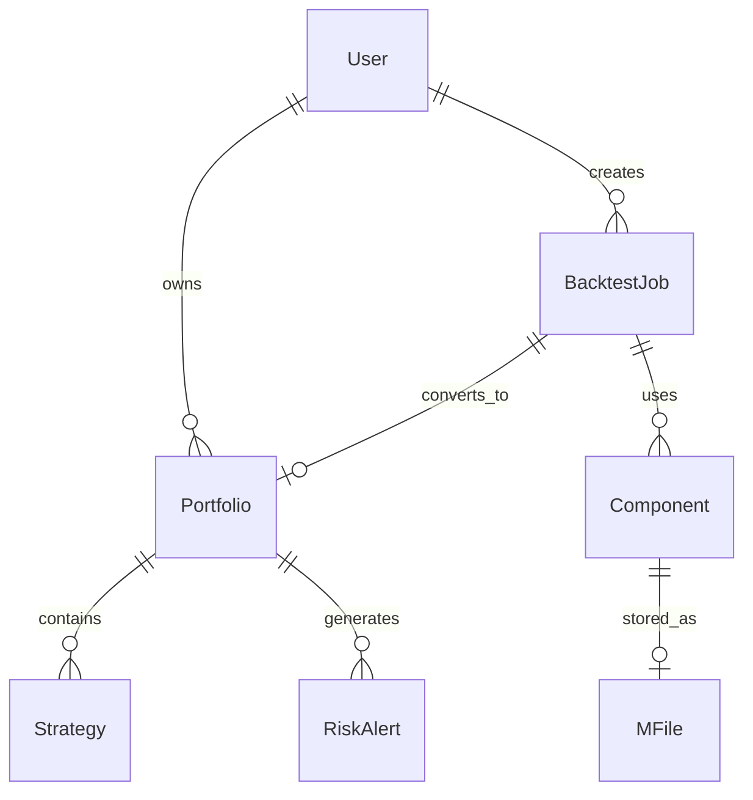

# Data Model Design

**Feature**: Web UI and API Server
**Date**: 2026-01-31
**Phase**: Phase 1 - Design & Contracts

## Entity Overview

| 实体 | 说明 | 主要属性 | 关系 |
|-----|------|---------|-----|
| User | 用户 | uuid, name, token, preferences | 1:N → BacktestJob, 1:N → Portfolio |
| BacktestJob | 回测任务 | uuid, name, status, start_date, end_date, initial_cash, result_json | N:1 → Component, 1:1 → Portfolio (Paper/Live) |
| Portfolio | 投资组合 | uuid, name, **mode**, config_locked, risk_config, state | 1:N → Strategy, 1:N → RiskAlert |
| Strategy | 策略 | uuid, name, type, portfolio_id, performance | N:1 → Portfolio |
| Component | 回测组件 | uuid, name, type, code, is_built_in, version | N:M → BacktestJob |
| RiskAlert | 风控警报 | uuid, type, portfolio_id, trigger_time, status, handled_at | N:1 → Portfolio |
| MFile | 组件文件 | uuid, name, type, data (binary) | 1:1 → Component (抽象) |
| APISession | API会话 | token, expires_at, user_id | N:1 → User |

## Entity Definitions

### User

用户实体，单用户场景下的唯一用户。

```python
class User:
    uuid: str                    # 主键
    name: str                    # 用户名
    password_hash: str           # 密码哈希
    token: str                   # API访问令牌
    preferences: dict            # 界面偏好设置
    created_at: datetime
    updated_at: datetime
```

**验证规则**:
- `uuid`: 必填，唯一标识符
- `name`: 必填，长度1-120字符
- `token`: 必填，用于API认证

### BacktestJob

回测任务实体，记录回测配置和执行状态。

```python
class BacktestJob:
    uuid: str                    # 主键
    name: str                    # 回测任务名称
    status: BacktestStatus       # 状态: PENDING/RUNNING/COMPLETED/FAILED
    start_date: date             # 回测开始日期
    end_date: date               # 回测结束日期
    initial_cash: float          # 初始资金
    commission_rate: float       # 手续费率
    result_json: dict            # 回测结果（JSON格式）
    portfolio_uuid: str | None   # 关联的Portfolio（转为Paper/Live后）
    created_at: datetime
    updated_at: datetime
```

**验证规则**:
- `uuid`: 必填，唯一标识符
- `name`: 必填，长度1-200字符
- `status`: 枚举值
- `initial_cash`: 必须 > 0
- `start_date` <= `end_date`

**状态流转**:
```
PENDING → RUNNING → COMPLETED
                 ↘ FAILED
```

### Portfolio

投资组合实体（顶层概念），包含运行模式和配置锁死状态。

```python
class Portfolio:
    uuid: str                    # 主键
    name: str                    # Portfolio名称
    mode: PortfolioMode          # 运行模式: BACKTEST/PAPER/LIVE
    state: PortfolioState        # 状态: INITIALIZED/RUNNING/PAUSED/STOPPED
    config_locked: bool          # 配置是否锁死（Paper和Live模式下为true）
    initial_cash: float          # 初始资金
    current_cash: float          # 当前现金
    risk_config: dict            # 风控配置（JSON格式）
    net_value_curve: list        # 净值曲线
    created_at: datetime
    updated_at: datetime

    # 关系
    user_uuid: str               # 所属用户
    strategies: list[Strategy]   # 包含的策略列表
    risk_alerts: list[RiskAlert] # 风控警报列表
```

**验证规则**:
- `uuid`: 必填，唯一标识符
- `name`: 必填，长度1-200字符
- `mode`: 枚举值（BACKTEST/PAPER/LIVE）
- `initial_cash`: 必须 > 0
- `config_locked`: 默认false，Paper和Live模式下为true

**模式流转规则**:
```
策略研发 → BACKTEST（回测） → PAPER（模拟盘，配置锁死） → LIVE（实盘，配置锁死）
```

**配置锁死规则**:
- BACKTEST模式: config_locked = false，可修改配置
- PAPER模式: config_locked = true，配置锁死
- LIVE模式: config_locked = true，配置锁死

### Strategy

策略实体，Portfolio的组成部分，记录单个策略的表现。

```python
class Strategy:
    uuid: str                    # 主键
    name: str                    # 策略名称
    type: StrategyType           # 类型: STRATEGY/SELECTOR/SIZER/RISKMANAGER
    component_uuid: str          # 关联的Component
    portfolio_uuid: str          # 所属Portfolio
    weight: float                # 权重
    performance: dict            # 表现指标（JSON格式）
    created_at: datetime
    updated_at: datetime
```

**验证规则**:
- `uuid`: 必填，唯一标识符
- `name`: 必填，长度1-200字符
- `type`: 枚举值
- `portfolio_uuid`: 必填（外键）
- `weight`: 默认1.0，范围(0, 1]

### Component

回测组件实体，存储用户自定义或预置的组件代码。

```python
class Component:
    uuid: str                    # 主键
    name: str                    # 组件名称
    type: ComponentType          # 类型: STRATEGY/SELECTOR/SIZER/RISKMANAGER/ANALYZER
    code: str                    # Python代码
    description: str             # 描述
    is_built_in: bool            # 是否为预置组件
    version: int                 # 版本号
    created_by: str              # 创建者
    created_at: datetime
    updated_at: datetime
```

**验证规则**:
- `uuid`: 必填，唯一标识符
- `name`: 必填，长度1-200字符
- `type`: 枚举值
- `code`: 必填，需要通过Python语法验证
- `is_built_in`: 预置组件不可删除或修改

**组件类型**:
- `STRATEGY`: 策略组件
- `SELECTOR`: 选股器组件
- `SIZER`: 仓位管理组件
- `RISKMANAGER`: 风控管理组件
- `ANALYZER`: 分析器组件

### RiskAlert

风控警报实体，记录风控触发事件。

```python
class RiskAlert:
    uuid: str                    # 主键
    type: AlertType              # 类型: STOP_LOSS/TAKE_PROFIT/POSITION_LIMIT
    portfolio_uuid: str          # 所属Portfolio
    strategy_uuid: str | None    # 触发的策略（可选）
    level: AlertLevel            # 级别: INFO/WARNING/ERROR/CRITICAL
    message: str                 # 警报消息
    triggered_at: datetime       # 触发时间
    handled: bool                # 是否已处理
    handled_at: datetime | None   # 处理时间
    created_at: datetime
```

**验证规则**:
- `uuid`: 必填，唯一标识符
- `type`: 枚举值
- `portfolio_uuid`: 必填（外键）
- `level`: 枚举值
- `message`: 必填

### MFile

组件文件实体，存储组件的Python代码二进制数据。

```python
class MFile:
    uuid: str                    # 主键
    name: str                    # 文件名
    type: str                    # 组件类型
    data: bytes                  # 二进制代码内容
    version: int                 # 版本号
    created_at: datetime
    updated_at: datetime
```

### APISession

API会话实体，管理用户登录会话。

```python
class APISession:
    token: str                   # 主键，JWT Token
    user_uuid: str              # 用户ID
    expires_at: datetime        # 过期时间
    created_at: datetime
```

## Entity Relationships



## Database Mapping

### MySQL Tables (关系数据)

| 表名 | 对应实体 | 说明 |
|-----|---------|------|
| users | User | 用户表 |
| backtest_jobs | BacktestJob | 回测任务表 |
| portfolios | Portfolio | 投资组合表 |
| strategies | Strategy | 策略表 |
| components | Component | 组件表 |
| risk_alerts | RiskAlert | 风控警报表 |
| api_sessions | APISession | API会话表 |

### MongoDB Collections (文档数据)

| 集合名 | 对应实体 | 说明 |
|-------|---------|------|
| m_files | MFile | 组件文件存储 |
| backtest_results | BacktestJob.result_json | 回测结果详情 |

### Redis Keys (缓存/状态)

| Key模式 | 说明 | TTL |
|---------|------|-----|
| `session:{token}` | 用户会话 | 24h |
| `portfolio:{uuid}:state` | Portfolio实时状态 | 无 |
| `ws:connections` | WebSocket连接ID列表 | 无 |
| `cache:dashboard:stats` | 仪表盘统计数据 | 60s |

## API DTO Models

### Request/Response Models

```python
# 认证相关
class LoginRequest(BaseModel):
    username: str
    password: str

class LoginResponse(BaseModel):
    token: str
    expires_at: datetime
    user: UserSummary

# Portfolio相关
class PortfolioCreate(BaseModel):
    name: str
    initial_cash: float
    risk_config: dict

class PortfolioResponse(BaseModel):
    uuid: str
    name: str
    mode: PortfolioMode
    state: PortfolioState
    config_locked: bool
    net_value: float
    positions: list

# Backtest相关
class BacktestCreate(BaseModel):
    name: str
    start_date: date
    end_date: date
    initial_cash: float
    components: dict  # {strategy: uuid, selector: uuid, ...}

class BacktestResponse(BaseModel):
    uuid: str
    name: str
    status: BacktestStatus
    result: dict | None

# 组件相关
class ComponentCreate(BaseModel):
    name: str
    type: ComponentType
    code: str
    description: str | None = None

class ComponentResponse(BaseModel):
    uuid: str
    name: str
    type: ComponentType
    is_built_in: bool
    version: int
    created_at: datetime
```

## Enums

```python
class PortfolioMode(str, Enum):
    BACKTEST = "BACKTEST"
    PAPER = "PAPER"
    LIVE = "LIVE"

class PortfolioState(str, Enum):
    INITIALIZED = "INITIALIZED"
    RUNNING = "RUNNING"
    PAUSED = "PAUSED"
    STOPPED = "STOPPED"

class BacktestStatus(str, Enum):
    PENDING = "PENDING"
    RUNNING = "RUNNING"
    COMPLETED = "COMPLETED"
    FAILED = "FAILED"

class ComponentType(str, Enum):
    STRATEGY = "STRATEGY"
    SELECTOR = "SELECTOR"
    SIZER = "SIZER"
    RISKMANAGER = "RISKMANAGER"
    ANALYZER = "ANALYZER"

class AlertType(str, Enum):
    STOP_LOSS = "STOP_LOSS"
    TAKE_PROFIT = "TAKE_PROFIT"
    POSITION_LIMIT = "POSITION_LIMIT"
    DRAWDOWN_LIMIT = "DRAWDOWN_LIMIT"

class AlertLevel(str, Enum):
    INFO = "INFO"
    WARNING = "WARNING"
    ERROR = "ERROR"
    CRITICAL = "CRITICAL"
```

## Indexes

### MySQL Indexes

```sql
-- Portfolios
CREATE INDEX idx_portfolio_mode ON portfolios(mode);
CREATE INDEX idx_portfolio_state ON portfolios(state);
CREATE INDEX idx_portfolio_user ON portfolios(user_uuid);

-- BacktestJobs
CREATE INDEX idx_backtest_status ON backtest_jobs(status);
CREATE INDEX idx_backtest_user ON backtest_jobs(user_uuid);
CREATE INDEX idx_backtest_dates ON backtest_jobs(start_date, end_date);

-- Components
CREATE INDEX idx_component_type ON components(type);
CREATE INDEX idx_component_user ON components(created_by);

-- RiskAlerts
CREATE INDEX idx_alert_portfolio ON risk_alerts(portfolio_uuid);
CREATE INDEX idx_alert_level ON risk_alerts(level);
CREATE INDEX idx_alert_handled ON risk_alerts(handled);
```

## Validation Rules Summary

| 字段 | 规则 | 错误消息 |
|-----|------|---------|
| Portfolio.name | 长度1-200 | "Portfolio名称必须在1-200字符之间" |
| Portfolio.initial_cash | > 0 | "初始资金必须大于0" |
| BacktestJob.end_date | >= start_date | "结束日期必须大于等于开始日期" |
| Component.code | 有效Python语法 | "代码语法错误: {error}" |
| Component.type | 枚举值 | "组件类型必须是STRATEGY/SELECTOR/SIZER/RISKMANAGER/ANALYZER之一" |
| User.token | 唯一 | "Token已存在" |

## Migration Strategy

### Phase 1: 添加Portfolio mode字段

```sql
ALTER TABLE portfolios ADD COLUMN mode VARCHAR(20) DEFAULT 'BACKTEST';
ALTER TABLE portfolios ADD COLUMN config_locked BOOLEAN DEFAULT FALSE;
UPDATE portfolios SET mode = 'BACKTEST', config_locked = FALSE;
```

### Phase 2: 创建新表

```sql
CREATE TABLE strategies (
    uuid VARCHAR(64) PRIMARY KEY,
    name VARCHAR(200) NOT NULL,
    type VARCHAR(50) NOT NULL,
    component_uuid VARCHAR(64) NOT NULL,
    portfolio_uuid VARCHAR(64) NOT NULL,
    weight FLOAT DEFAULT 1.0,
    performance JSON,
    created_at DATETIME DEFAULT CURRENT_TIMESTAMP,
    updated_at DATETIME DEFAULT CURRENT_TIMESTAMP ON UPDATE CURRENT_TIMESTAMP,
    FOREIGN KEY (portfolio_uuid) REFERENCES portfolios(uuid),
    FOREIGN KEY (component_uuid) REFERENCES components(uuid)
);
```

### Phase 3: 数据迁移

```python
# 将现有Portfolio的配置迁移到strategies表
for portfolio in portfolios:
    for component_id in portfolio.component_ids:
        strategy = Strategy(
            uuid=generate_uuid(),
            name=component.name,
            type=component.type,
            component_uuid=component.uuid,
            portfolio_uuid=portfolio.uuid,
            weight=1.0
        )
        db.add(strategy)
```
