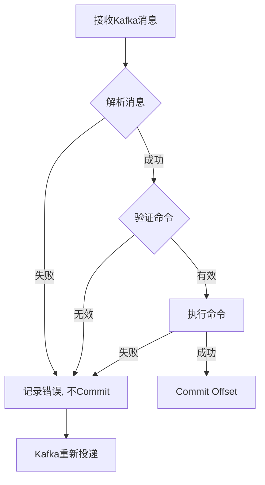

# Data Worker - Kafka Message Contracts

**Feature**: 009-data-worker
**Date**: 2025-01-23
**Status**: Phase 1 Design

## Overview

Data Worker通过Kafka接收控制命令和发送数据质量报告。本文档定义所有消息的格式契约。

---

## 1. 消费者契约 (Consumer)

Data Worker从以下Kafka主题消费消息：

### 1.1 控制命令主题

**Topic**: `ginkgo.live.control.commands`
**Consumer Group**: `data_worker_group`
**Offset Strategy**: `earliest`
**Commit**: Manual (after successful processing)

#### 消息格式

```json
{
    "command": "bar_snapshot",
    "timestamp": "2025-01-23T15:30:00Z",
    "request_id": "uuid-v4",
    "params": {
        "codes": ["000001.SZ", "600000.SH"],
        "start_date": "20250101",
        "end_date": "20250123",
        "frequency": "1d"
    }
}
```

#### 支持的命令

| 命令 | 描述 | 参数 |
|------|------|------|
| `bar_snapshot` | K线快照采集 | `codes`, `start_date`, `end_date`, `frequency` |
| `update_selector` | 更新股票池 | `market` (可选) |
| `update_data` | 增量数据更新 | `codes`, `days` (可选) |
| `heartbeat_test` | 心跳测试 | 无 |

#### 命令详细定义

##### bar_snapshot - K线快照采集

```json
{
    "command": "bar_snapshot",
    "timestamp": "2025-01-23T15:30:00Z",
    "request_id": "550e8400-e29b-41d4-a716-446655440000",
    "params": {
        "codes": ["000001.SZ", "600000.SH"],
        "start_date": "20250101",
        "end_date": "20250123",
        "frequency": "1d",
        "adjust_type": "qfq"
    }
}
```

**参数说明**:
- `codes`: 股票代码列表 (可选，默认为全部)
- `start_date`: 开始日期 (YYYYMMDD格式)
- `end_date`: 结束日期 (YYYYMMDD格式)
- `frequency`: 频率 (`1d`=日频, `1m`=分钟, `5m`=5分钟)
- `adjust_type`: 复权类型 (`qfq`=前复权, `hfq`=后复权, `none`=不复权)

##### update_selector - 更新股票池

```json
{
    "command": "update_selector",
    "timestamp": "2025-01-23T08:00:00Z",
    "request_id": "550e8400-e29b-41d4-a716-446655440001",
    "params": {
        "market": "SZ"
    }
}
```

**参数说明**:
- `market`: 市场代码 (可选，`SZ`=深圳, `SH`=上海, `None`=全部)

##### update_data - 增量数据更新

```json
{
    "command": "update_data",
    "timestamp": "2025-01-23T16:00:00Z",
    "request_id": "550e8400-e29b-41d4-a716-446655440002",
    "params": {
        "codes": ["000001.SZ"],
        "days": 5
    }
}
```

**参数说明**:
- `codes`: 股票代码列表 (可选，默认为全部)
- `days`: 更新最近N天 (可选，默认=5)

##### heartbeat_test - 心跳测试

```json
{
    "command": "heartbeat_test",
    "timestamp": "2025-01-23T10:00:00Z",
    "request_id": "550e8400-e29b-41d4-a716-446655440003",
    "params": {}
}
```

---

## 2. 生产者契约 (Producer)

Data Worker向以下Kafka主题发送消息：

### 2.1 通知主题

**Topic**: `ginkgo.notifications`
**Producer**: Data Worker
**Key**: `data_worker_quality_report`

#### 数据质量报告消息

```json
{
    "type": "data_quality_report",
    "timestamp": "2025-01-23T15:35:00Z",
    "source": "data_worker_1",
    "data": {
        "report_id": "uuid-v4",
        "task_type": "bar_snapshot",
        "records_expected": 1000,
        "records_actual": 998,
        "success_rate": 0.998,
        "records_failed": 0,
        "records_skipped": 2,
        "anomalies": [
            {
                "code": "000001.SZ",
                "date": "2025-01-23",
                "field": "close",
                "value": -1.0,
                "reason": "negative_price"
            }
        ],
        "duration_seconds": 45.2
    }
}
```

#### 告警消息

```json
{
    "type": "data_collection_alert",
    "timestamp": "2025-01-23T15:30:00Z",
    "source": "data_worker_1",
    "severity": "ERROR",
    "data": {
        "alert_type": "data_missing",
        "task_type": "bar_snapshot",
        "expected": 1000,
        "actual": 800,
        "threshold": 0.8,
        "affected_codes": ["000001.SZ", "000002.SZ"]
    }
}
```

**告警类型**:
- `data_missing`: 数据缺失
- `data_delayed`: 数据延迟
- `source_error`: 数据源错误
- `validation_error`: 数据验证失败

---

## 3. 消息处理契约

### 3.1 消息处理流程



### 3.2 错误处理

| 错误类型 | 处理策略 | 是否Commit |
|----------|----------|------------|
| JSON解析失败 | 记录错误，跳过 | ✅ (避免poison pill) |
| 未知命令 | 记录警告，跳过 | ✅ |
| 参数验证失败 | 记录错误，跳过 | ✅ |
| 数据源连接失败 | 记录错误，重试 | ❌ (触发重新投递) |
| 数据采集失败 | 记录错误，继续 | ✅ (部分失败) |
| 数据库写入失败 | 记录错误，重试 | ❌ (触发重新投递) |

---

## 4. 消息Schema定义

### 4.1 控制命令Schema (JSON Schema)

```json
{
    "$schema": "http://json-schema.org/draft-07/schema#",
    "type": "object",
    "required": ["command", "timestamp", "request_id"],
    "properties": {
        "command": {
            "type": "string",
            "enum": ["bar_snapshot", "update_selector", "update_data", "heartbeat_test"]
        },
        "timestamp": {
            "type": "string",
            "format": "date-time"
        },
        "request_id": {
            "type": "string",
            "format": "uuid"
        },
        "params": {
            "type": "object",
            "properties": {
                "codes": {
                    "type": "array",
                    "items": {"type": "string"}
                },
                "start_date": {
                    "type": "string",
                    "pattern": "^\\d{8}$"
                },
                "end_date": {
                    "type": "string",
                    "pattern": "^\\d{8}$"
                },
                "frequency": {
                    "type": "string",
                    "enum": ["1d", "1m", "5m", "15m", "30m", "60m"]
                },
                "adjust_type": {
                    "type": "string",
                    "enum": ["qfq", "hfq", "none"]
                },
                "days": {
                    "type": "integer",
                    "minimum": 1
                }
            }
        }
    }
}
```

### 4.2 质量报告Schema (JSON Schema)

```json
{
    "$schema": "http://json-schema.org/draft-07/schema#",
    "type": "object",
    "required": ["type", "timestamp", "source", "data"],
    "properties": {
        "type": {
            "type": "string",
            "enum": ["data_quality_report", "data_collection_alert"]
        },
        "timestamp": {
            "type": "string",
            "format": "date-time"
        },
        "source": {
            "type": "string"
        },
        "severity": {
            "type": "string",
            "enum": ["INFO", "WARNING", "ERROR"]
        },
        "data": {
            "type": "object",
            "required": ["report_id", "task_type"],
            "properties": {
                "report_id": {
                    "type": "string",
                    "format": "uuid"
                },
                "task_type": {
                    "type": "string"
                },
                "records_expected": {
                    "type": "integer",
                    "minimum": 0
                },
                "records_actual": {
                    "type": "integer",
                    "minimum": 0
                },
                "success_rate": {
                    "type": "number",
                    "minimum": 0,
                    "maximum": 1
                },
                "records_failed": {
                    "type": "integer",
                    "minimum": 0
                },
                "records_skipped": {
                    "type": "integer",
                    "minimum": 0
                },
                "anomalies": {
                    "type": "array",
                    "items": {
                        "type": "object",
                        "properties": {
                            "code": {"type": "string"},
                            "date": {"type": "string"},
                            "field": {"type": "string"},
                            "value": {},
                            "reason": {"type": "string"}
                        }
                    }
                },
                "duration_seconds": {
                    "type": "number",
                    "minimum": 0
                }
            }
        }
    }
}
```

---

## 5. 兼容性说明

### 5.1 向后兼容

Data Worker保持与现有GTM模式的兼容性：
- 控制命令格式与GTM兼容
- Kafka topic名称与现有系统一致
- 消息解析支持新旧格式

### 5.2 版本控制

消息格式包含版本标识，用于未来兼容性处理：

```json
{
    "version": "1.0",
    "command": "bar_snapshot",
    ...
}
```

---

## 6. 测试契约

### 6.1 单元测试消息示例

```python
# tests/unit/workers/data_worker/test_message_processing.py

VALID_BAR_SNAPSHOT = {
    "command": "bar_snapshot",
    "timestamp": "2025-01-23T15:30:00Z",
    "request_id": "550e8400-e29b-41d4-a716-446655440000",
    "params": {
        "codes": ["000001.SZ"],
        "start_date": "20250101",
        "end_date": "20250123",
        "frequency": "1d"
    }
}

INVALID_COMMAND = {
    "command": "unknown_command",
    "timestamp": "2025-01-23T15:30:00Z",
    "request_id": "550e8400-e29b-41d4-a716-446655440001",
    "params": {}
}

MALFORMED_MESSAGE = "invalid json string"
```
