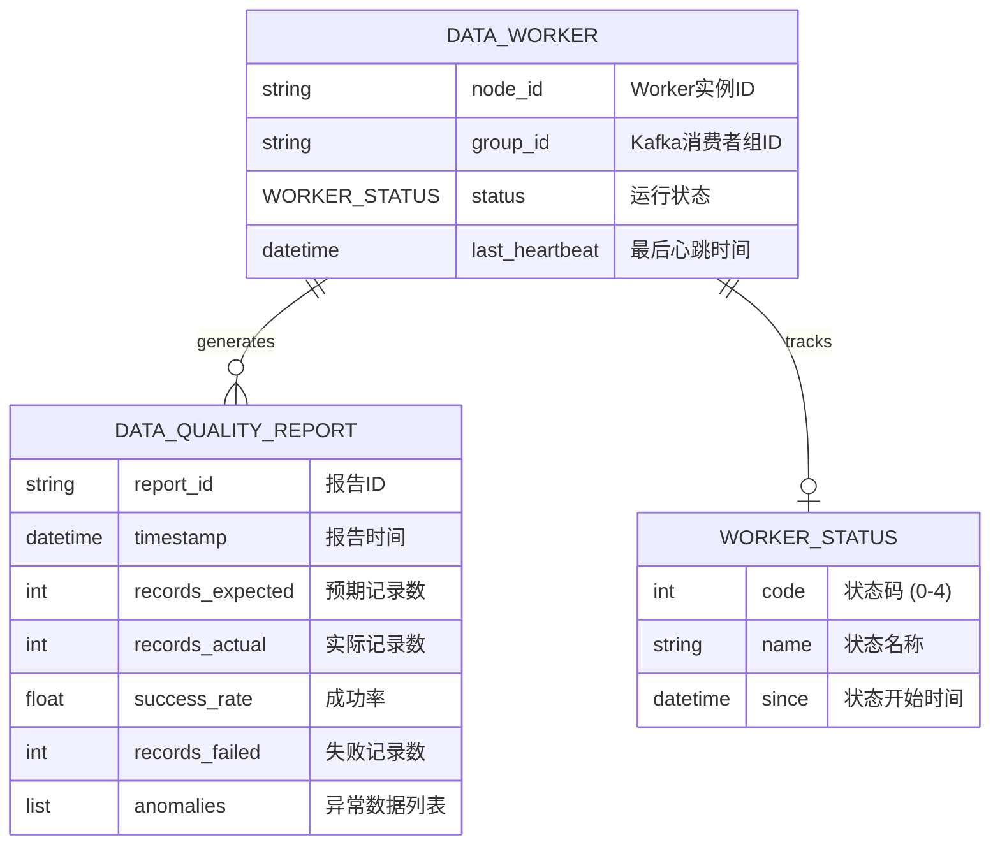
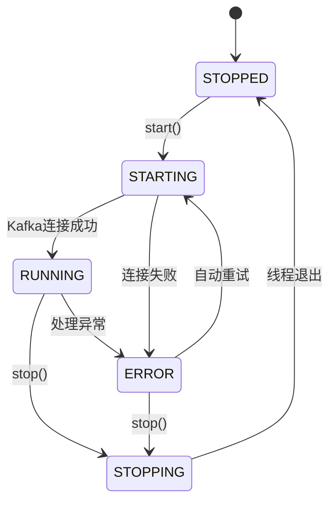

# Data Worker - Data Model

**Feature**: 009-data-worker
**Date**: 2025-01-23
**Status**: Phase 1 Design (Updated)

## Entity Overview

Data Worker涉及3个核心实体，用于数据采集执行和监控。数据源配置已集成在现有的数据获取方法中（如`BarCRUD.get_bars()`），无需额外配置。



---

## 1. DataWorker (Worker主类)

### 描述
数据采集Worker主类，继承自`threading.Thread`，负责订阅Kafka消息并执行数据采集。数据源通过现有方法（如`BarCRUD.get_bars()`）访问，配置由GCONF管理。

### 字段定义

| 字段名 | 类型 | 必填 | 默认值 | 描述 |
|--------|------|------|--------|------|
| `node_id` | str | ✅ | `hostname:pid` | Worker实例唯一标识 |
| `group_id` | str | ✅ | `"data_worker_group"` | Kafka消费者组ID |
| `status` | WorkerStatus | ✅ | `STOPPED` | 当前运行状态 |
| `_consumer` | GinkgoConsumer | ✅ | - | Kafka消费者实例 |
| `_stats` | dict | ✅ | `{}` | 统计信息 |

### 状态枚举 (WorkerStatus)

| 值 | 名称 | 描述 |
|----|------|------|
| 0 | STOPPED | 已停止 |
| 1 | STARTING | 启动中 |
| 2 | RUNNING | 运行中 |
| 3 | STOPPING | 停止中 |
| 4 | ERROR | 错误状态 |

### 状态转换



### 统计信息 (_stats)

```python
{
    "messages_processed": 0,      # 已处理消息数
    "messages_failed": 0,          # 处理失败消息数
    "bars_collected": 0,           # 采集的K线数量
    "bars_written": 0,             # 写入数据库的K线数量
    "last_message_time": None,     # 最后处理消息时间
    "last_error": None,            # 最后错误信息
    "uptime_seconds": 0,           # 运行时长（秒）
}
```

### 数据采集方式

Data Worker通过现有的CRUD方法获取数据，数据源配置已集成在内部：

```python
from ginkgo import services

# 获取BarCRUD服务
bar_crud = services.data.cruds.bar()

# 数据源已集成在方法内部，通过GCONF配置
bars = bar_crud.get_bars(
    code="000001.SZ",
    start_date="20250101",
    end_date="20250123"
)
# 内部自动使用配置的数据源（Tushare/Yahoo等）

# 批量写入
bar_crud.add_bars(bars)
```

---

## 2. DataQualityReport (数据质量报告)

### 描述
记录单次数据采集任务的质量指标，用于监控和告警。

### 字段定义

| 字段名 | 类型 | 必填 | 默认值 | 描述 |
|--------|------|------|--------|------|
| `report_id` | str | ✅ | UUID | 报告唯一标识 |
| `timestamp` | datetime | ✅ | `now()` | 报告生成时间 |
| `task_type` | str | ✅ | - | 任务类型：`bar_snapshot`, `update_data` |
| `records_expected` | int | ✅ | - | 预期记录数 |
| `records_actual` | int | ✅ | - | 实际采集记录数 |
| `success_rate` | float | ✅ | - | 成功率 (0-1) |
| `records_failed` | int | ✅ | 0 | 失败记录数 |
| `records_skipped` | int | ✅ | 0 | 跳过记录数（验证失败） |
| `anomalies` | list | ❌ | `[]` | 异常数据详情 |
| `duration_seconds` | float | ✅ | - | 采集耗时（秒） |

### 异常数据格式 (anomalies)

```python
[
    {
        "code": "000001.SZ",
        "date": "2025-01-23",
        "field": "close",
        "value": -1.0,           # 异常值
        "reason": "negative_price"  # 异常原因
    }
]
```

### 质量阈值

| 指标 | 阈值 | 告警级别 |
|------|------|---------|
| `success_rate` | < 0.99 | WARNING |
| `success_rate` | < 0.95 | ERROR |
| `duration_seconds` | > 300 | WARNING |
| `records_actual / records_expected` | < 0.8 | ERROR |

---

## 3. WorkerStatus (Worker状态)

### 描述
Worker当前运行状态的快照，存储在Redis用于监控。

### 字段定义

| 字段名 | 类型 | 必填 | 默认值 | 描述 |
|--------|------|------|--------|------|
| `node_id` | str | ✅ | - | Worker实例ID |
| `status_code` | int | ✅ | - | 状态码 (0-4) |
| `status_name` | str | ✅ | - | 状态名称 |
| `timestamp` | datetime | ✅ | `now()` | 状态更新时间 |
| `host` | str | ✅ | `hostname` | 主机名 |
| `pid` | int | ✅ | - | 进程ID |
| `messages_processed` | int | ✅ | 0 | 已处理消息数 |
| `last_error` | str | ❌ | `None` | 最后错误信息 |

### Redis存储格式

**Key**: `heartbeat:data_worker:{node_id}`
**TTL**: 30秒
**Value** (JSON):

```json
{
    "timestamp": "2025-01-23T10:30:00",
    "component_type": "data_worker",
    "component_id": "data-worker-1",
    "host": "ginkgo-server-01",
    "pid": 12345,
    "status": {
        "code": 2,
        "name": "RUNNING"
    },
    "stats": {
        "messages_processed": 1523,
        "messages_failed": 2,
        "bars_collected": 45600,
        "bars_written": 45598
    }
}
```

---

## 关系说明

### 1. DataWorker → DataQualityReport
- **关系类型**: 1:N (每个Worker生成多个报告)
- **存储**: Reports推送到Kafka `ginkgo.notifications` 主题

### 2. DataWorker → WorkerStatus
- **关系类型**: 1:1 (每个Worker维护一个状态)
- **存储**: Redis心跳键，TTL自动清理

---

## 数据源配置说明

数据源配置已集成在现有CRUD方法中，通过GCONF管理：

```yaml
# ~/.ginkgo/config.yml (数据源配置已存在)
data_sources:
  tushare:
    token: ${TUSHARE_TOKEN}
    enabled: true
  yahoo:
    enabled: true
```

Data Worker无需额外配置，直接使用现有的数据获取方法：

```python
# Data Worker内部实现
from ginkgo import services

bar_crud = services.data.cruds.bar()

# 获取数据（数据源已配置）
bars = bar_crud.get_bars(code, start, end)

# 写入数据
bar_crud.add_bars(bars)
```

---

## 使用示例

```python
# 创建Worker（无需数据源配置）
worker = DataWorker(
    node_id="data-worker-1",
    group_id="data_worker_group"
)

# 启动Worker
worker.start()

# 检查状态
if worker.status == WorkerStatus.RUNNING:
    print(f"Worker is running, processed {worker.stats['messages_processed']} messages")

# 停止Worker
worker.stop(timeout=30)
```
